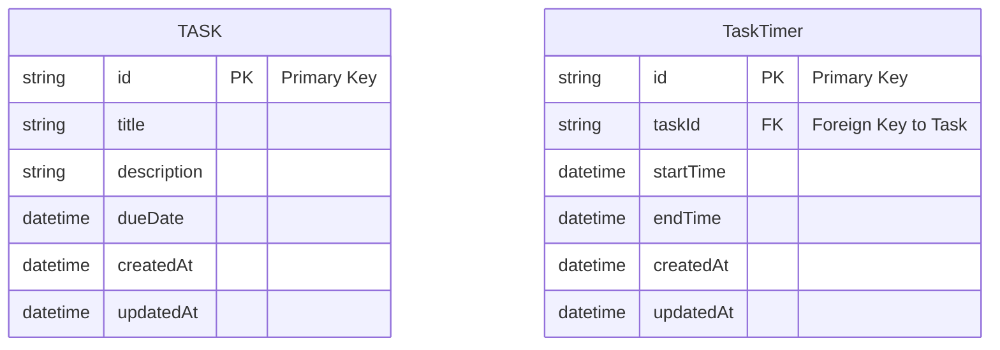

The Shuchu is an application for managing focused work sessions. It should provide the task management and time tracking features to help users stay focused on their work.

## UIs

### List of Tasks

The main UI of Shuchu is the list of tasks. Users can add, edit, and delete tasks from this list. Each task has a title, description, and a status (e.g., "To Do", "In Progress", "Done").

#### Focus timer

The focus timer is a Pomodoro-style timer that helps users stay focused on their work. Users can start, pause, and reset the timer. When the timer is running, users should focus on the task at hand and avoid distractions.

The user can push the start button placed next to each task to start the focus timer for that task. When the timer is running, the task should be highlighted to indicate that it is the current focus.

# Data Structure

Mermaid diagram of the data structure used in Shuchu:

