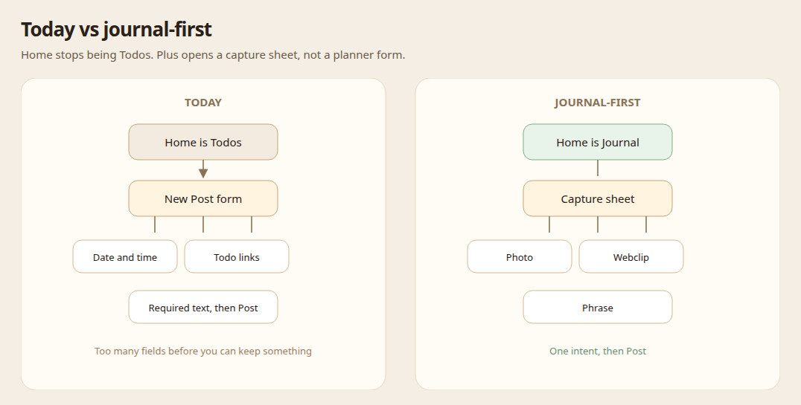
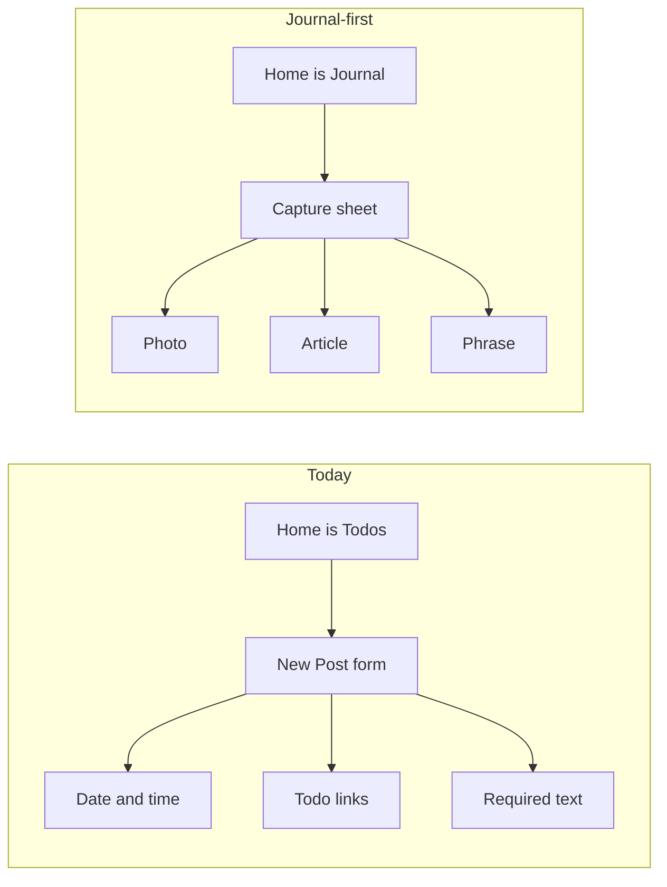
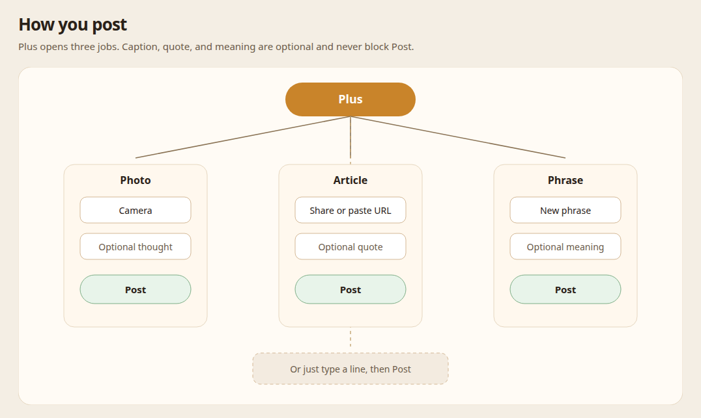
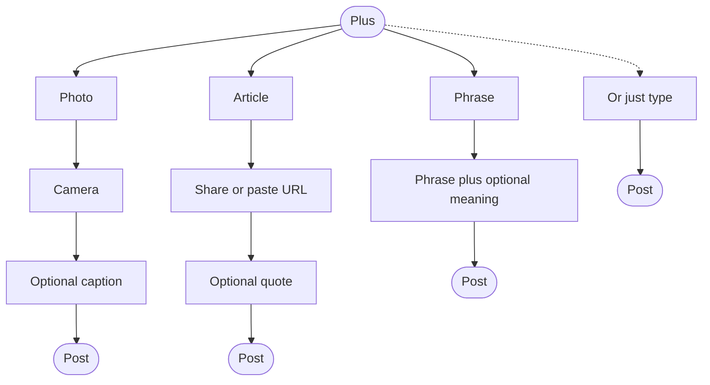
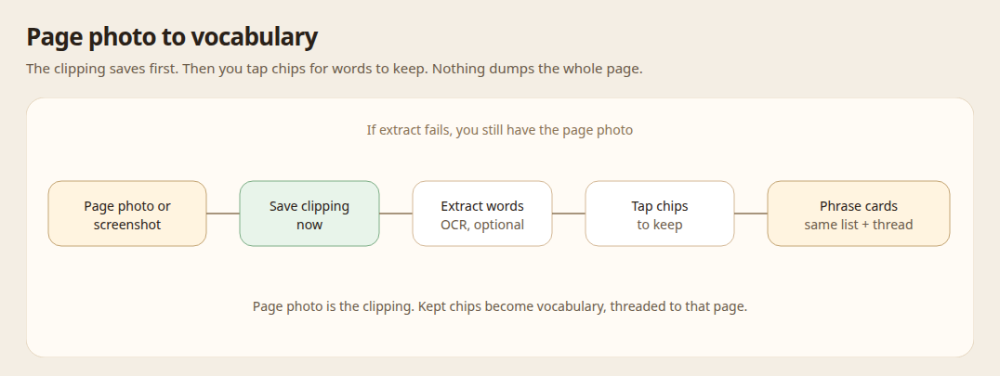
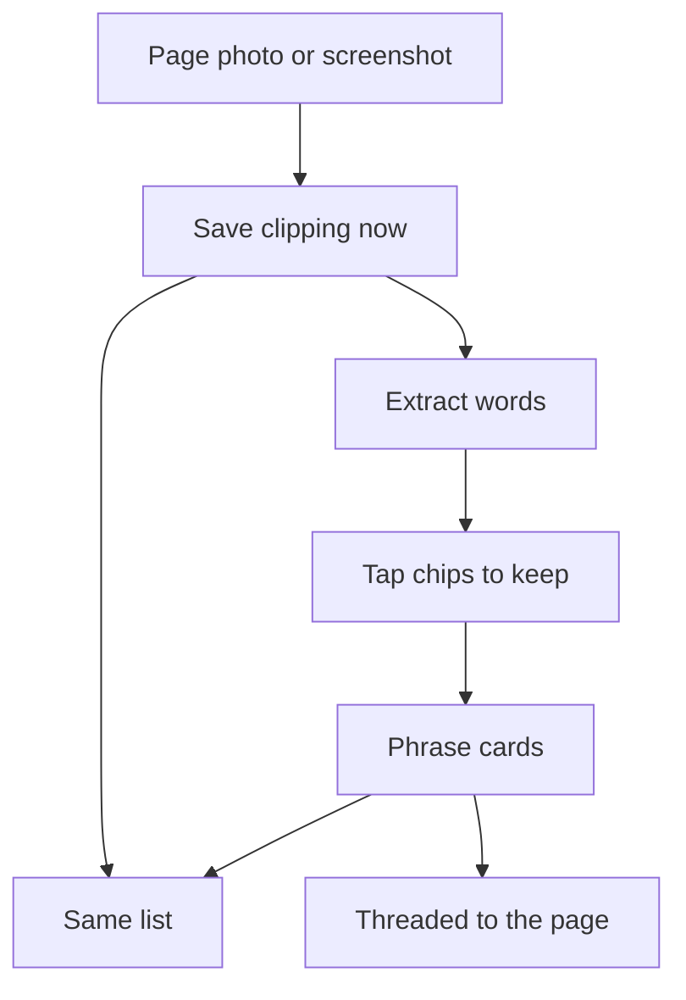
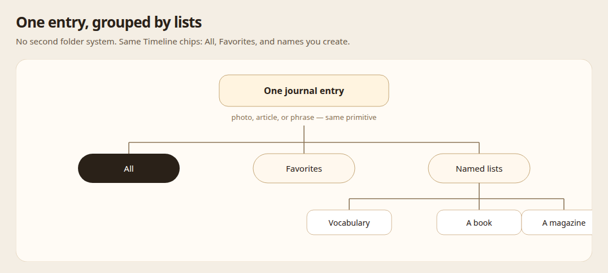
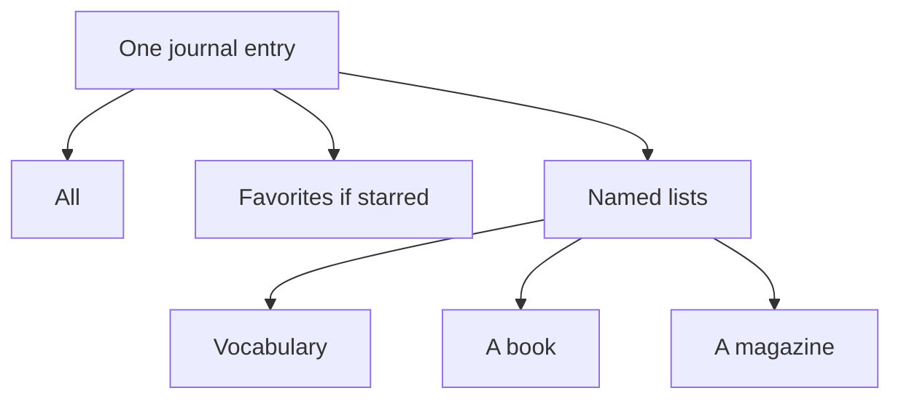

# Techoo as a private journal

## Context

Techoo shipped as a **daily planner**: calendar to-dos as the plan, posts as a text log of what happened, notes for everything off the timeline. The current surfaces still encode that:

- Mobile home tab is **ToDos**; desktop default tab is **Todo**.
- Posts are **text-only** (`body` + `posted_at`). They can link to todos/events, be starred, and sit in named lists — but they have **no images**, no source/citation, no language fields.
- The composer assumes schedule context (associate a post with today's todos/`#` mentions).
- Notes are free-form pages; they are a dump, not a visual journal or a highlight inbox.

After using the app, the product pull is different:

1. **More journal** — the thing worth opening is the day's writing and pictures, not the task list.
2. **Todos should not be required** — a day with no planned blocks should still be a complete day in Techoo.
3. **Image share, Instagram-ish UI** — capture a photo (page, sign, meal, chalkboard) and browse a visual, private feed. "Share" here means *share into* the journal (Photos / Safari / share sheet), not a public social graph.
4. **Highlights of articles and books** — save a passage with enough source to find it again.
5. **Language learning** — the same capture habit, for sentences and words met in the wild.

The 手帳 metaphor still fits, and actually fits *this* better than the planner reading. A paper techo (Hobonichi, Traveler's Notebook) is a book you carry: dated pages, clippings, quotes, language scraps. The grid of tasks is optional stationery, not the reason the book exists.

`docs/CONCEPT.md` is updated to this product thesis. This ADR records the product and technical decisions so later work does not re-litigate "are we a planner?"

### Constraints

- Keep auth, per-user tenant DBs, and the existing posts/lists/favorites APIs. Do not big-bang a new domain the way `2026-04-11-techo-revamp` did.
- Stay single-user and private. Instagram-ish is **layout and capture**, not followers, likes-from-others, or a public profile.
- Do not become Anki, Readwise, or Day One clones. Those are reference products for *one* job each.
- Existing todo and calendar data stay. Demote, do not delete.

## Decision

### Product thesis

**Techoo is a private journal you carry.** The unit of attention is still *the day*, but the day is told by **entries** (photos, writing, highlights, language scraps), not by a required plan.

Todos and calendar remain available. They are no longer the home screen, and a journal entry does not need a todo to be valid.

### Diagrams

#### Today vs journal-first

#### How you post

#### Page photo to vocabulary

#### One entry, grouped by lists

### One primitive: journal entry (evolve `posts`)

Do **not** add three new resources (moments / highlights / language cards). Evolve `posts` into journal entries with optional attachments and optional structured fields.

| Field (conceptual) | Role | Required? |
|---|---|---|
| `body` | Caption, quote, or free writing | Soft — empty allowed if an image is present |
| `posted_at` | When it belongs on the day | Yes (defaults to now) |
| images | One or more photos | No |
| `source` | Book / article title, author, URL, page | No — used for highlights |
| `language` | BCP-47 tag of the captured text (e.g. `ja`, `en`, `fr`) | No — used for language learning |
| `gloss` | Translation or note on the captured text | No |
| lists / favorite | Existing collections | Unchanged |
| todo / event links | Optional context | Unchanged, no longer prompted by default |

Soft **intents** (composer presets, not schema enums) so the UI can be specific without fragmenting storage:

- **Moment** — photo-first, short caption.
- **Highlight** — quoted `body` + `source` (+ optional page photo).
- **Language** — `body` in the target language + `gloss` + `language` (+ optional photo of the sign/page).
- **Free** — writing with no extra fields.

Filtering later: `?language=ja`, `?has_source=true`, list tabs already in Timeline. A "French" list plus `language=fr` can coexist; lists stay human-named collections, language is a typed facet.

### Images and Instagram-ish UI

**Capture**

- Attach images on create/update of a post.
- Mobile: camera + library. Desktop: file picker / paste.
- OS share-in (iOS share extension / Android share intent) is the "image share" job: a photo or selected text from Safari/Books lands as a new entry. Treat this as the second slice after in-app attach, not as social posting.

**Browse**

- Home becomes a **visual journal feed**: full-bleed or near-full-bleed image, caption under, date/time quiet, actions (star, list, thread) secondary.
- Text-only entries still belong (a highlight with no photo, a language sentence typed on the train). They use a large-type card, not a tiny log row.
- Keep the warm, private Techo tone from `docs/UI_DESIGN_PRINCIPLES.md`. Instagram-ish means **photo hierarchy and card rhythm**, not black chrome, story rings, or engagement counts.

**Storage (when implemented)**

- Do not base64 images into SQLite. Object storage (R2, already used for APK) + a `post_images` table (`post_id`, `object_key`, `width`, `height`, `sort_order`).
- Serve via authenticated URLs or short-lived signed URLs. Tenant isolation stays the same as post rows.

### Highlights of articles / books

A highlight is a journal entry whose job is **keep the passage and the pointer**.

Minimum useful source:

- `title` (book or article)
- optional `author`, `url`, `locator` (page, chapter, or "12:04 in the essay")

That is enough to reopen the book or the tab. Do not model a bibliographic database, import Kindle/Readwise, or OCR as v1. A photo of the page *is* a valid highlight even if `body` is empty at first (you can type the quote later).

Existing **lists** are the right collection primitive ("Murakami", "New Yorker", "work reading"). Do not add a `books` table until lists plus `source.title` feel insufficient.

### Language learning

Language learning is a **lens on the same entries**, not a study app.

v1 job: **capture in the moment** (sentence on a page, phrase on a sign, line in an article).

- `language` + `gloss` on the entry.
- Timeline filter / tab: "Japanese", "French", or "has language".
- Review later (SRS, quizzes, cloze) is explicitly **out**. If review is added, it should read from these entries, not invent a parallel card deck.

This keeps Techoo from competing with Anki while still being the place sentences *enter* your life.

### Todos are optional

- **Keep** `todos`, calendar sync, and post↔todo links. Data and the later-todos / week grid stay valid.
- **Demote** from primary navigation. Mobile home and desktop default become the journal feed (today's Timeline, visual). Todos move under Library / Settings-adjacent, or a secondary tab.
- **Composer:** do not require or auto-suggest todo association. `#` mentions can remain as power-user linking.
- **Empty day:** a journal with zero todos is a complete product state, not an onboarding gap.

Do not drop the todos schema in this reconsideration. Revisit deletion only if months of journal-first use show the calendar layer unused.

### Notes

Notes stay the **long page**: drafts, reference, writing that is not a dated card. Highlights and language scraps should *not* go to notes by default — they want a timestamp and a feed. Notes are where a highlight *grows* if it becomes an essay.

### Surfaces (target)

| Surface | Role after this shift |
|---|---|
| **Home / Journal** | Visual chronological feed. Primary tab. List chips stay (All / Favorites / named lists). |
| **Capture** | The product. Photo, article, phrase — not a generic “New Post” form. |
| **Lists & favorites** | Grouping. Same primitive as today’s Timeline tabs. |
| **Library** | Todos, calendar, notes — available, not the front door. |
| **Settings** | Auth, calendars, later: default language, storage. |

### Capture UX — posting must be the easy thing

The product succeeds or fails on **how little work it is to keep something**. Today’s mobile composer (`app/post/new.tsx`) is a planner form: date, time, todo/list associations, `#` mentions, and a required body before Post is enabled. That is the opposite of a journal you actually use on the street or in a book.

**Friction budget**

- A complete entry in **one intent + Post** (two interactions). A third interaction is allowed for a caption, a meaning, or picking extracted words.
- Optional fields never block Post. Empty caption is fine if there is a photo. Empty meaning is fine if there is a phrase. Empty extract is fine if the page photo is saved.
- Date, time, and todo links are **edit-later**. They do not appear on capture.
- If the user is already on a Timeline list tab, the new entry **inherits that list** (this already works via `associationsFromTimelineTab`). No extra “pick a folder” step.

**+ is a capture sheet, not a form**

Home `+` opens a short sheet with three jobs that match how people actually post. Typing in the sheet with no job selected is still allowed (free line).

| Action | Opens | Done when |
|---|---|---|
| **Photo** | Camera (long-press / secondary: library) | Photo is on the card; caption optional; Post |
| **Article** | Paste URL / accept a share | Title + link are on the card; quote optional; Post |
| **Phrase** | Keyboard on a large phrase field | Phrase is there; meaning optional; Post |

Do not put all three jobs on one scrolling form. Each job is its own small sheet so the first screen only asks for the one thing that job needs.

#### 1. Photo + brief thought

Instagram-ish **capture**, private **keep**.

1. Tap Photo → shutter (or pick from library).
2. Land on a sheet: large photo, one caption field (“a thought”), Post.
3. Post immediately. Crop, filters, location, and todo links are out.

The feed card is the photo with the thought under it. This is the default visual rhythm of Home.

#### 2. Article that catches their eye

“Click” means **one save when something in the world catches you**, not that Techoo becomes a reader or an article browser.

Primary path: **Share → Techoo** from Safari / reader / any app (URL, and selected text if any).

In-app path: Article → paste a URL. Unfurl title, site, and preview image so the card looks like a clipping, not a raw link.

- `body` = selected quote, or empty until later.
- `source.url` + `source.title` from the unfurl.
- Tap the saved card later to reopen the article.

We do not build a discover feed of articles. The world’s browsers already do “things that catch your eye.” Techoo is the pocket they fall into.

#### 3. Record a new phrase (vocabulary)

A two-field sheet. Keyboard up on open.

- **Phrase** — large type, the only field that matters.
- **Meaning** — one line, optional (gloss, translation, or a note to self).
- Language defaults to **last used** (Settings can pin a default). No language picker on the first screen.

Post creates a language entry. From a list tab named “Vocabulary” / “French”, it files there automatically.

This is capture, not study. No “add example sentence / part of speech / deck” on the way in.

#### 4. Book screenshot / page photo → extract words

Same Photo path, plus an **extract** assist after the page is already saved.

1. Photo of the page or a screenshot lands as a normal photo entry (the clipping).
2. Extract runs in the background (OCR, later optional model assist). Failure still leaves the photo — extract is never a gate.
3. A chip picker shows candidate words/phrases on the page. **Tap to keep.** Do not dump the whole page into vocabulary.
4. Each kept item becomes a phrase entry: `body` = the word/phrase, image = crop or pointer back to the page, `parent_post_id` = the page photo (thread already exists).
5. All of them inherit the current list (e.g. the book’s list).

The page photo is the clipping; the chips are the vocabulary. Opening the page thread later shows which words came from it.

#### 5. Group like today’s Timeline lists

Do **not** invent folders, notebooks, or a second taxonomy.

Keep the existing Timeline chrome:

- **All** — the journal
- **Favorites** — stars
- **Named lists** — “Vocabulary”, a book title, “New Yorker”, a trip

Rules that make grouping cheap:

- Creating from a list tab files into that list (already true).
- After Post, a single optional row of list chips if you are on All and want to file it. Skip = stays on All.
- Long-press a list tab to rename/delete (already true).
- Suggested first lists on an empty journal: `Vocabulary`, and whatever you name when you save the first book/article.

Lists are how a techo has sections. They are not tags you must apply to every card.

**What the capture sheets hide**

Today’s New Post chrome that we drop from the happy path:

- Date and time pickers (default: now)
- `PostComposerAssociationsBar` and “Type `#` to link to-dos…”
- Required non-empty `body` when an image or URL is present
- Full-screen title “New Post”

Power users can still edit those on the entry after it exists.

### Implementation slices (not this PR)

This PR is the product decision only. Suggested build order when we implement — **capture ease first**:

1. **Journal-first chrome** — Home = Timeline/journal; todos off the primary tab bar. Keep list chips.
2. **Capture sheet** — Photo / Article / Phrase instead of the current New Post form. Phrase can ship as text-only (`body` + later `gloss`). Inherit the active list.
3. **Images + visual feed** — `post_images` + R2; photo+thought path; Instagram-like cards.
4. **Article share / unfurl** — share-in URL + selected text; in-app paste + preview card.
5. **Highlight / language fields** — `source_*`, `language`, `gloss` so article and phrase sheets persist structure.
6. **Extract from page** — OCR on a saved photo; chip-picker; child phrase posts via `parent_post_id`.

Slice 2 is the real UX test. If posting a phrase from a list tab is not faster than today’s form, the rest of the schema will not save the product.

### Interactive mock

Single HTML file, click through on desktop:

[`agents/plans/assets/2026-09-20/journal-capture-mock.html`](./assets/2026-09-20/journal-capture-mock.html)

Open in a browser (or `python3 -m http.server` in that folder). Phone-sized Journal with Photo / Article / Phrase, extract chips, list inheritance, and Library for demoted todos.

### Mock assessment (after clicking through)

Clicked every capture path on the mock. Verdict: **the product idea holds; the three-job sheet is the right front door; two UX traps showed up immediately.**

**What felt right**

- Home as Journal, with no todo, already feels like a different app. Library as the extra tap is an acceptable cost.
- Phrase cards (large Japanese + gloss) are the strongest object. They read as a techo, not as a log line.
- List chips + inheritance work. Opening Vocabulary then Phrase files there without a folder picker.
- Extract-after-save is the correct order. Skip is available. Tap-to-keep chips match “don’t dump the page.”
- Post is always one tap away once the intent is chosen. Date/time/todos never appeared. That is the whole point.

**Friction the mock made obvious**

1. **Photo is still too many taps.** `+` → Photo → pick a shot → Post is 3–4 steps. “Take a photo and a thought” wants shutter first (long-press `+`, or Photo opens the camera). The in-mock picker (cafe / page / sign) is a stand-in; in product, camera *is* the first screen of Photo.
2. **All-feed gets noisy after extract.** Kept words land as sibling cards above the page. Lists group them (Vocabulary, Murakami), but All looks like a vocab quiz, not a journal. Prefer: All shows the **page clipping** with “2 words kept”; the words live in Vocabulary (and in the page thread).
3. **Article “click” is fake here.** Tapping a sample title is not how catching-your-eye works. The real gesture is Share from Safari. The in-app sheet should be paste-URL / recent clip, not a fake magazine rack.
4. **Mixed card rhythm is not Instagram yet.** Phrase cards are type-forward (good). Photo cards will only feel Instagram-ish with real photos, full-bleed, caption under — gradients in the mock don’t prove that. Article cards should be clippings (preview image + title), not only italic quotes.
5. **`+` covers the last card.** Classic FAB overlap. More feed padding, or a capture bar above the tab.
6. **Stars are small.** Easy to miss on a real phone.
7. **Sheet vs input (fixed in the mock).** First pass closed the sheet when tapping the caption field (scrim ate the click). Capture sheets must treat the sheet as a trap for taps; only the dimmed area dismisses.

**Changes to the decision from using it**

- Keep the three-job sheet. Do **not** make Home a camera-only Instagram. Phrase and article would lose.
- Add **long-press `+` = camera** so the photo+thought path is one gesture.
- Extracted words default into **Vocabulary** (and the book list), not into All as peer posts. All keeps the page.
- Article v1 is share-in, not in-app discovery.

**Tap budget we actually saw** (happy path, after the input bug fix)

| Job | Taps to saved | Notes |
|---|---|---|
| Phrase from Vocabulary | 4 | + , Phrase, type, Post |
| Article (sample click) | 4 | + , Article, sample, Post |
| Book page + 2 words | ~8 | + , Photo, page, Post, 2 chips, Keep |

Phrase and article are close to the budget. Book+extract is allowed to be longer because extract is a second beat after the clipping exists.

## Consequences

## Consequences

### What gets better

- The techo metaphor matches how the app is actually being used.
- A day without tasks is still worth opening.
- Photos, quotes, and language scraps share one inbox instead of leaking to Notes, camera roll, or other apps.
- Lists/favorites already paid for collections; highlights and languages reuse them.

### What we give up (for now)

- Planner-first identity in `CONCEPT.md` and the home screen. Calendar-centric users will take an extra tap to reach todos.
- A dedicated SRS / Readwise-class highlight manager. Capture quality first.
- Public sharing. "Instagram-ish" will be misunderstood if we are sloppy in copy; UI chrome must stay private and warm.
- Auto-dumping a whole book page into vocabulary. Extract is tap-to-keep, not ingest-everything.

### Rejected alternatives

| Alternative | Why not |
|---|---|
| Delete todos now | Calendar + existing data still useful; demote first. |
| New `highlights` + `language_cards` tables | Three inboxes. Posts already have time, lists, favorites, threads. |
| Notes as the journal | Notes have no feed rhythm, no `posted_at` story, no visual card. |
| Full social Instagram | Conflicts with single-user / private techo. |
| Anki-in-Techoo | Different habit (review vs capture). Revisit only after capture works. |
| Build an in-app article reader / discover feed | “Caught my eye” happens in the browser. Share-in is the click. |
| New folder/notebook taxonomy | Timeline lists already group. Inherit the active list on capture. |
| Extract-before-save | OCR failure would lose the clipping. Save the photo first; chips second. |
| Second big-bang revamp | Auth, tenant DBs, posts, lists are fine. Evolve posts; do not replace the domain layer. |

### Docs

- `docs/CONCEPT.md` — product thesis plus “How you post”.
- Interactive mock: `agents/plans/assets/2026-09-20/journal-capture-mock.html`
- Mobile README still points at CONCEPT; update its one-liner when chrome actually changes (slice 1).
